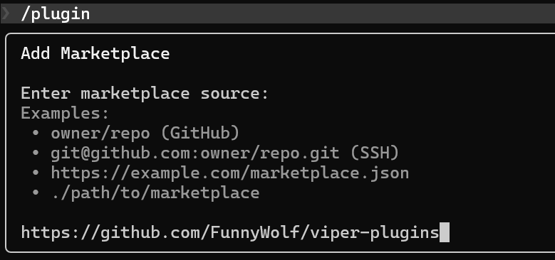
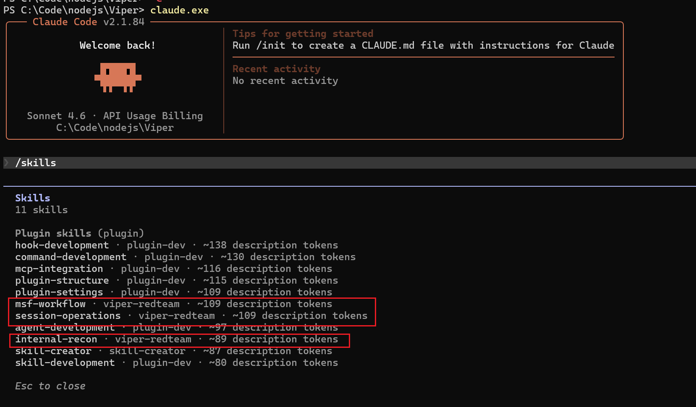
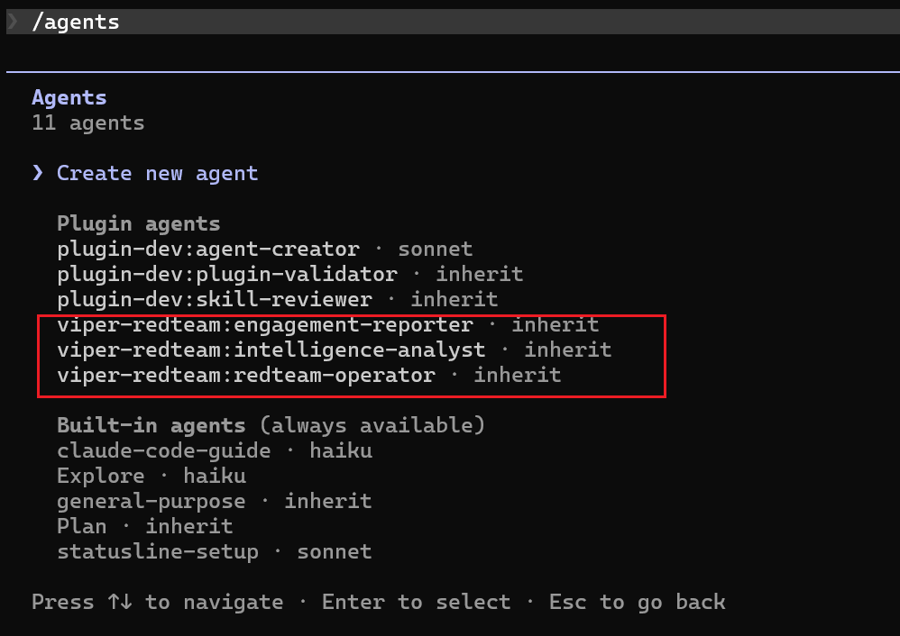

# Operate Viper with Skills

## Install the viper-redteam Plugin

- Start the Viper MCP server. See the [MCP Server](../../guide/mcpserver.md) documentation, then copy the MCP server URL (`http://your_server_ip:8000/XXXXXXXXXXXXX/sse`).
- Set the URL in the `VIPER_MCP_SSE_URL` environment variable.

PowerShell:
```powershell
$env:VIPER_MCP_SSE_URL = "http://your_server_ip:8000/XXXXXXXXXXXXX/sse"
```

Bash:
```bash
export VIPER_MCP_SSE_URL="http://your_server_ip:8000/XXXXXXXXXXXXX/sse"
```

- Start Claude Code, add the `https://github.com/FunnyWolf/viper-plugins` marketplace, and install the `viper-redteam` plugin.




## Use the viper-redteam Plugin

- Use skills.


- Available skills.



- Available agents.


