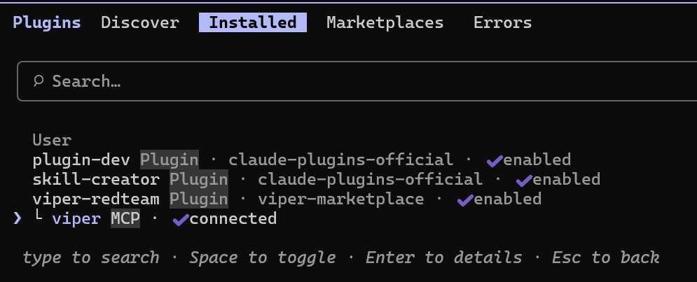
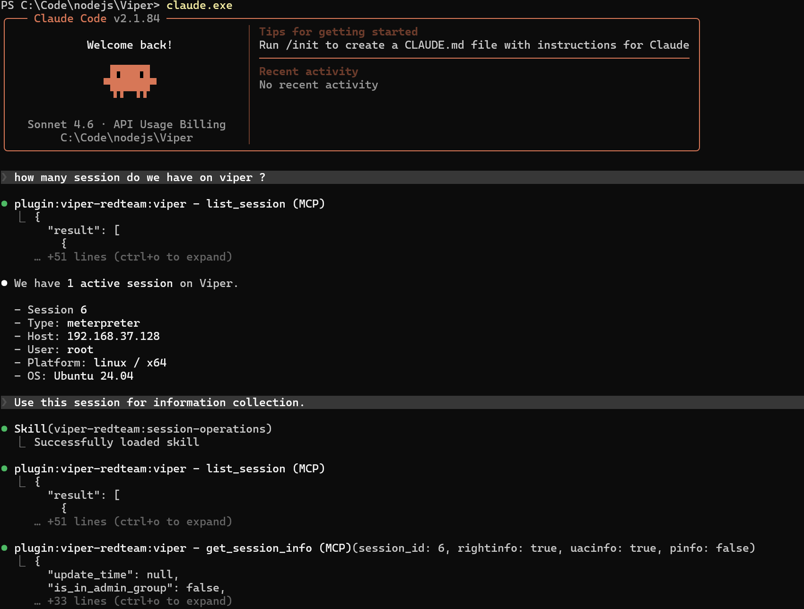

# Claude Code Plugin

## 安装 viper-redteam plugin

- 启动 viper MCP 服务器,文档参考 [MCP 服务器](../../guide/mcpserver.md), 记录 MCP 服务器 URL (http://your_server_ip:8000/XXXXXXXXXXXXX/sse)
- 将 url 设置到环境变量 VIPER_MCP_SSE_URL

PowerShell:
```powershell
$env:VIPER_MCP_SSE_URL = "http://your_server_ip:8000/XXXXXXXXXXXXX/sse"
```

Bash:
```bash
export VIPER_MCP_SSE_URL="http://your_server_ip:8000/XXXXXXXXXXXXX/sse"
```

- 启动 Claude Code , 添加 https://github.com/FunnyWolf/viper-plugins marketplace, 安装 viper-redteam plugin





## 使用 viper-redteam plugin

- 使用 skill



- 可用的 skill 


- 可用的 agent

